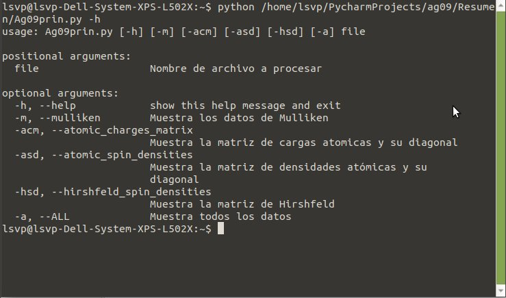
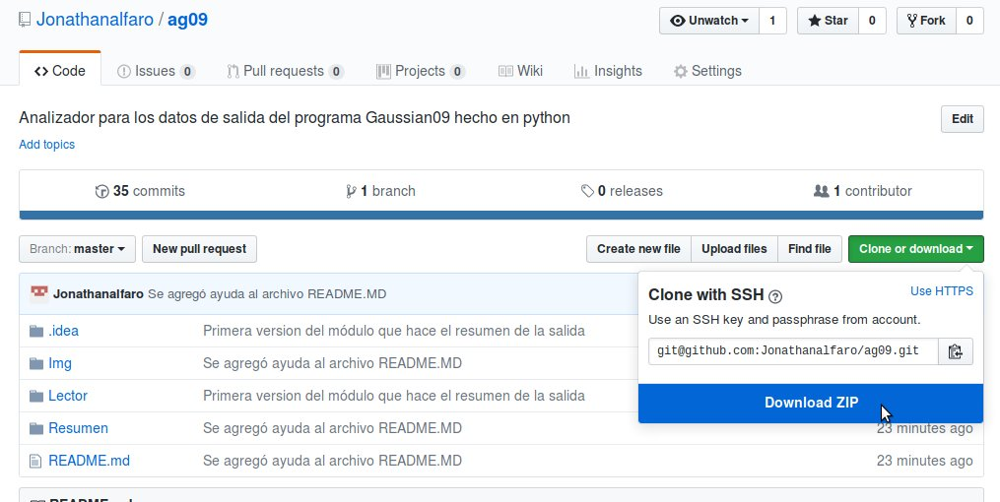

# analizadorgaussian
Programa hecho en Python para el análisis de datos de salida del programa Gaussian09

## Ayuda de descarga
Para uso local del programa primero necesita descargarlo a su computadora.

1. En la página de Github de clic en la opción 'Clone or download'

    

2. Despues de clic en la opción  'Download ZIP'
    
    

3. Extraiga el contenido del archivo

## Ayuda de uso

1. En una terminal cambie el directorio de trabajo a la ubicación donde extrajo el contenido del archivo descargado

2. Ejecute el programa de la siguiente manera

    ```
        python Resumen/Ag09principal.py [opciones] [ruta del log]
    ```
    Ejemplo:

    ```
        python Resumen/Ag09principal.py -a /home/USUARIO/Documentos/SERVICIO_SOCIAL/BzPhsolo.out
    ```

3. Se puede analizar un archivo o muchos a la vez

    ```
        python Resumen/Ag09Principal.py -a /home/lsvp/Documentos/ARCHIVO.out`
    ```
    o
    ```
        python Resumen/Ag09Principal.py -a /home/lsvp/Documentos/*.out`
    ```
## Ayuda en el programa

El programa cuenta con una ayuda a la que puede accederse con el atajo -h

    `python /home/lsvp/PycharmProjects/ag09/Resumen/Principal.py -h`

Lo cual da como salida lo siguiente

    

Lista de opciones

| Opción corta | Opción larga | Acción |
| - | - | - |
| -h | --help | show this help message and exit |
| -t | --texto | Muestra los resultados en la salida estandar |
| -m | --mulliken | Muestra los datos de Mulliken |
| -hf | --hirshfeld | Muestra el valor hf |
| -apt | --APT_atomic | Muestra los datos de APT |
| -tq | --thermochemical | Muestra los datos termoquímicos |
| -acm | --atomic_charges_matrix | Muestra la matriz de cargas atomicas y su diagonal |
| -asd | --atomic_spin_densities | Muestra la matriz de densidades atómicas y su diagonal |
| -hsd | --hirshfeld_spin_densities | Muestra la matriz de Hirshfeld | 
| -a | --ALL | Muestra todos los datos posibles | 
| -e | --exporta | Exporta los datos a un archivo CSV |
