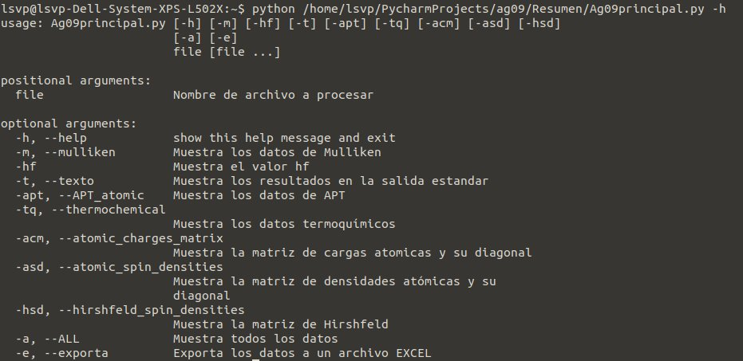

# analizadorgaussian
Analizador  de datos de salida del programa Gaussian09 hecho en python y con la libreria curses

## Ayuda de descarga

Para el uso en su máquina local primero necesita descargar el programa.

1. En la página de Github de clic en la opción 'Clone or download'

2. Despues de clic en la opción  'Download ZIP'

3. Extraiga el contenido del archivo

## Ayuda de uso

1. En una terminal cambie el directorio de trabajo a la ubicación donde extrajo el contenido del archivo descargado

2. Ejecute el programa de la siguiente manera

`python Resumen/Ag09principal.py [opciones] [ruta del log]`

Ejemplo:

`python Resumen/Ag09principal.py -a /home/lsvp/Documentos/SERVICIO_SOCIAL/BzPhsolo.out
`

El programa cuenta con una ayuda a la que puede accederse con el atajo -h

`python /home/lsvp/PycharmProjects/ag09/Resumen/Principal.py -h`

Lo cual da como salida lo siguiente

Lista de opciones

| Opción | Acción |
| - | - |
| -a | Muestra toda la informacion que se puede extraer del archivo .log|
| -m | Muestra la informacion de APT atomic charges y APT atomic charges whit hydrogens summed |
| -acm | Muestra Atomic Charges Matrix y los valores de su diagonal|
| -hsd | Muestra Hirshfeld Spin Densities | 
| -asd | Muestra Atomic Spin Densities Matrix y su diagonal| 