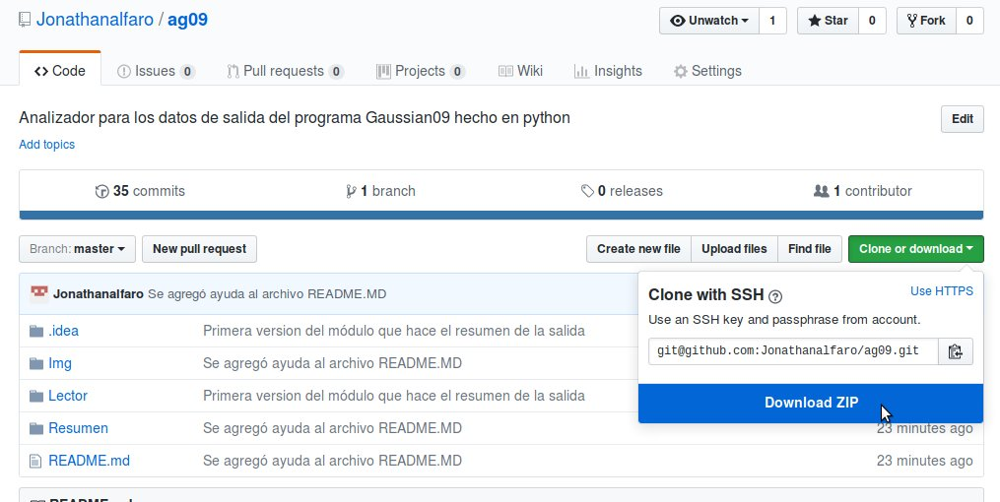

## Ayuda de descarga
Para uso local del programa primero necesita descargarlo a su computadora.

1. En la página de Github de clic en la opción 'Clone or download'

    

2. Despues de clic en la opción  'Download ZIP'
    
    

3. Extraiga el contenido del archivo

[Descarga](https://github.com/Jonathanalfaro/ag09/archive/master.zip)