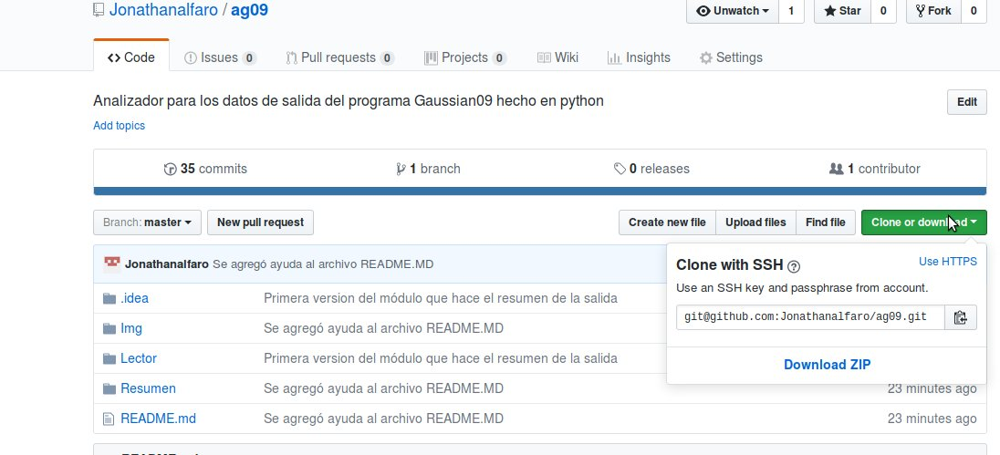

## Programas necesarios  

  
Ag09 fue programado en Python 2.7, para asegurar su funcionamiento asegúrese de que está usando esta versión o
instale miniconda para la versión de Python especificada.  

* [Descarga miniconda](https://conda.io/miniconda.html)

Para el uso de wget y git asegúrese de tener instalados estos programas en su sistema  

El programa no ha sido probado en entornos Windows pero debería funcionar si cuenta con lo anterior.

Descarga  
=
Para empezar a usar este programa escoja una de las siguientes opciones:

Descargue el programa con wget  

  `    

Clone el repositorio de Github  
----
  ` git clone https://github.com/Jonathanalfaro/ag09.git `

Descargue desde Github
----
    
    

Desde el siguiente link [Ag09](https://github.com/Jonathanalfaro/ag09/archive/master.zip)
----

